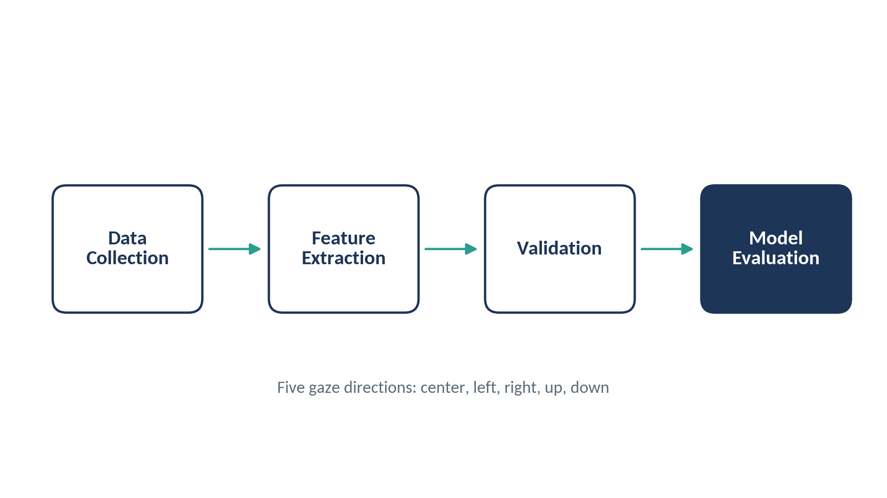

# Eye-Tracking Based Direction Control Using Machine Learning

**M.S. Thesis · San José State University · Department of Applied Data Science · May 2026**
Lakshmi Bharathy Kumar

Can a computer reliably tell where a person is looking, so that eye movements can control a machine hands-free? This thesis builds and evaluates a machine learning pipeline that turns raw eye-tracking data into gaze direction predictions: center, left, right, up, and down.

## Video overview

▶️ **[Watch the 1-minute thesis overview](assets/Eye_tracking_Based_Directional_Control_720p.mp4)**

## The problem

Most control devices depend on the hands, which excludes people with limited mobility and fails in settings where hands are busy. Eye movement is a natural alternative, but eye-tracking data is noisy: eyes make constant small movements, and every person's gaze behaves a little differently. A model that works for one person may not work for the next.

## Approach

1. **Data collection:** a controlled lab study, conducted under an approved university IRB protocol, using a head-mounted eye tracker that records gaze coordinates and eye video.
2. **Feature extraction:** several representations of gaze, from coordinate-based features to attention heatmaps and eye images.
3. **Validation:** data quality checks before any modeling.
4. **Model evaluation:** machine learning and deep learning models, tested on both familiar and completely new users.

## Data quality and validation

Before modeling, the data was checked to make sure the labels could be trusted:

- **Class balance:** checked how evenly each gaze direction was represented, and used balanced class weights and F1-based metrics where features were uneven.
- **Cluster separability:** measured how tightly each direction's data grouped and how well directions separated (silhouette score, separation ratio), using cosine distance for high-dimensional image features where Euclidean distance was misleading.
- **Label alignment:** a transition analysis confirmed that labels followed the recording protocol's timeline.

## Feature engineering

- Gaze coordinates converted to distance-and-angle (polar) form
- Fixation points that capture stable periods of attention
- Density-peak fixation points found with kernel density estimation
- Gaussian attention heatmaps
- Eye images from both infrared eye cameras, treated separately per eye

## Modeling and evaluation

- **Machine learning models:** Logistic Regression, SVM, Decision Tree, Random Forest, and Gradient Boosted Trees on coordinate-based features
- **Deep learning models:** fine-tuned ResNet18 and MobileNetV2 on heatmaps and eye images
- **Leakage-free design:** training and test data come from separate recording sessions, and preprocessing runs inside model pipelines
- **Fair tuning:** the same stratified grid search, optimized on macro-F1, across every setting
- **Generalization:** user-dependent evaluation plus leave-one-user-out cross-validation, where each participant is held out of training once

## Key takeaways

- How the data is represented matters as much as the choice of model.
- Compressing gaze too aggressively removes noise but also removes useful detail.
- The two eyes behave differently, so they are best analyzed separately.
- Models trained on several people can outperform single-user models because they learn from more variety.
- Validating data quality first is what makes the results trustworthy.

## Applications

Assistive technology for people with limited mobility, gaze-directed robotics, AR/VR interfaces, and hands-free control in hands-busy work settings.

## Skills demonstrated

Experimental data collection · Data cleaning and quality validation · Exploratory analysis and visualization · Feature engineering · Statistical validation · Machine learning and deep learning · Cross-validation and generalization testing · Python, scikit-learn

## About this repository

The code, data, and detailed results are not shared here. The full thesis text is currently under embargo while a follow-on publication is in preparation. This repository provides an overview of the research questions, methods, and skills involved.

## Citation

Lakshmi Bharathy Kumar, "Eye-Tracking Based Direction Control Using Machine Learning Technique," M.S. thesis, Department of Applied Data Science, San José State University, 2026. https://doi.org/10.31979/etd.h3rd-h8n2

## Contact

[LinkedIn](https://linkedin.com/in/lakshmibharathy-kumar) · [GitHub](https://github.com/Lakshmibharathy11) · lakshmibharathy.kumar@gmail.com
